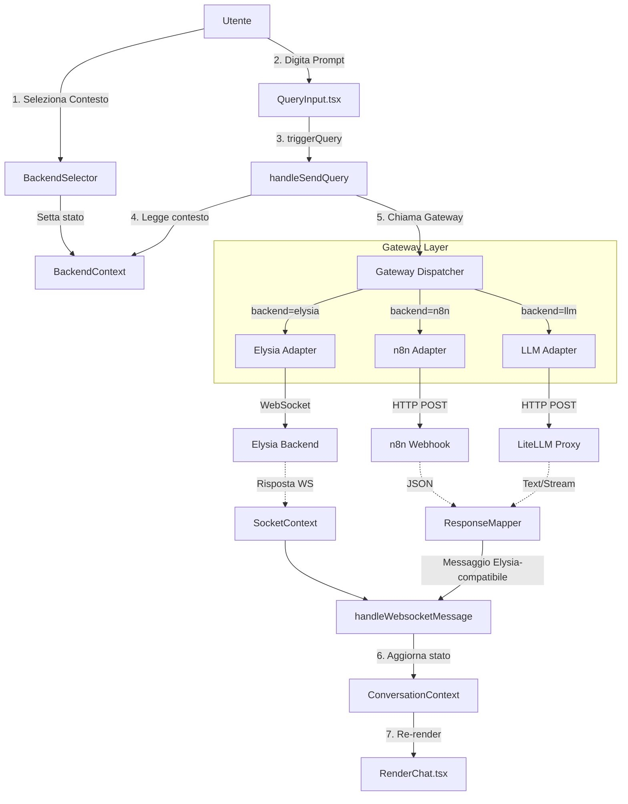

# Design Document: Elysia Multi-Backend Portal
## Context-Based Routing Architecture

---

## 1. Executive Summary

Questo documento propone un'architettura per trasformare `elysia-frontend` in un **portale unificato** dove l'utente seleziona esplicitamente il "contesto" di destinazione (Elysia RAG, n8n Workflow, LLM Libero) **prima** di inviare un prompt. L'obiettivo è ottenere massima flessibilità senza compromettere la possibilità di integrare future release di Elysia.

### Requisiti Chiave
1.  **UX Esplicita**: L'utente deve selezionare il backend/contesto in modo chiaro e visibile.
2.  **Routing Determinato dall'UI**: La selezione del contesto determina la destinazione del prompt.
3.  **Isolamento Codice Custom**: Le modifiche devono essere "pluggabili" e non conflittuali con aggiornamenti upstream.
4.  **Riutilizzo UI Esistente**: La UI di chat deve visualizzare risposte da tutti i backend senza duplicazione di componenti.

---

## 2. Analisi del Codice Esistente

### 2.1 Punti di Forza Rilevati

#### `QueryInput.tsx` (Componente Chiave)
```typescript
// Linea 13: La funzione già supporta un parametro `route`
handleSendQuery: (query: string, route?: string, mimick?: boolean) => void;

// Linea 31: Stato locale per il routing (attualmente usato solo in dev mode)
const [route, setRoute] = useState<string>("");
```
> **Implicazione**: Il parametro `route` esiste già nel flusso. Non serve inventare nuovi contratti.

#### `CollectionSelection.tsx` (Pattern UI Riutilizzabile)
Il componente usa `DropdownMenu` di Radix per selezionare le collection. Questo pattern è **ideale** per un "Context Selector":
- Compatto (icona nella barra di input)
- Stato persistente nel Context React
- Nessuna modifica alla struttura della pagina

#### `SocketContext.tsx` (Punto di Iniezione Gateway)
```typescript
// Linea 132-142: L'invio del messaggio è centralizzato
socket?.send(JSON.stringify({ user_id, query, ... }));
```
> **Implicazione**: Il Gateway può intercettare qui e dirottare verso altri backend.

#### `ConversationContext.tsx` (Iniezione Risposte)
```typescript
// Linea 790: Funzione pubblica per iniettare messaggi
const handleWebsocketMessage = (message: Message | null | undefined) => { ... }
```
> **Implicazione**: Qualsiasi risposta esterna (n8n, LLM) può essere "finta" come messaggio WebSocket.

### 2.2 Punti di Attenzione

| Area | Stato Attuale | Impatto |
|------|---------------|---------|
| `route` state in `QueryInput` | Visibile solo in `NODE_ENV=development` | Dobbiamo esporre il selettore in production |
| Nessun "BackendContext" | Il concetto di "backend attivo" non esiste | Serve un nuovo Context React isolato |
| Tipi Elysia rigidi | `Message`, `ResultPayload`, etc. sono ottimizzati per Elysia | Serve un Mapper per convertire risposte esterne |

---

## 3. Architettura Proposta

### 3.1 Struttura Directory (Codice Isolato)

```plaintext
/app
  /integrations                    <-- TUTTO IL CODICE CUSTOM QUI
    /contexts
      BackendContext.tsx           <-- Stato globale del backend selezionato
    /components
      BackendSelector.tsx          <-- UI del selettore (dropdown)
    /gateway
      index.ts                     <-- Dispatcher principale
      adapters/
        elysiaAdapter.ts           <-- Passthrough verso WebSocket nativo
        n8nAdapter.ts              <-- Chiamate HTTP verso Webhook n8n
        llmAdapter.ts              <-- Chiamate verso LiteLLM/DSPy
      mappers/
        responseMapper.ts          <-- Converte JSON esterni in tipi Elysia
    /config
      backends.config.ts           <-- Configurazione endpoint (pluggabile)
```

### 3.2 Flusso Logico Dettagliato



### 3.3 Modifiche ai File Core (Minime)

Per rispettare l'obiettivo di isolamento, le modifiche ai file originali di Elysia saranno **chirurgiche e marcate**:

#### File 1: `SocketContext.tsx`
**Linee interessate**: ~115-145 (funzione `sendQuery`)

```diff
// SocketContext.tsx
+ import { Gateway } from "@/app/integrations/gateway";
+ import { useContext } from "react";
+ import { BackendContext } from "@/app/integrations/contexts/BackendContext";

const SocketProvider = ({ children }) => {
+   const { currentBackend } = useContext(BackendContext);
    
    const sendQuery = async (...) => {
+       // --- CUSTOM INTEGRATION GATEWAY START ---
+       const handled = await Gateway.dispatch({
+           backend: currentBackend,
+           user_id, query, conversation_id, query_id, route,
+           onMessage: handleWebsocketMessage,
+       });
+       if (handled) return true;
+       // --- CUSTOM INTEGRATION GATEWAY END ---
        
        socket?.send(JSON.stringify({ ... }));
    };
};
```
**Complessità Merge**: La modifica è racchiusa in un blocco commentato. In caso di conflitto, basta reinserire le 5 righe.

#### File 2: `QueryInput.tsx`
**Linee interessate**: ~154 (aggiunta componente selettore)

```diff
// QueryInput.tsx
+ import BackendSelector from "@/app/integrations/components/BackendSelector";

// Nel JSX, accanto a CollectionSelection:
  <div className="flex justify-end gap-1 w-full">
+   <BackendSelector />
    <CollectionSelection />
    <Button ...>
```
**Complessità Merge**: Singola riga di import e singola riga nel JSX.

#### File 3: `layout.tsx` (o altro Provider wrapper)
**Linee interessate**: Wrapping con `BackendProvider`

```diff
// layout.tsx o App wrapper
+ import { BackendProvider } from "@/app/integrations/contexts/BackendContext";

return (
+ <BackendProvider>
    <SocketProvider>
      ...
    </SocketProvider>
+ </BackendProvider>
);
```

### 3.4 Componenti Custom Isolati

#### `BackendContext.tsx`
```typescript
// app/integrations/contexts/BackendContext.tsx
"use client";
import { createContext, useState, ReactNode } from "react";

export type BackendType = "elysia" | "n8n" | "llm";

interface BackendConfig {
  id: BackendType;
  label: string;
  icon: React.ReactNode;
  endpoint?: string;
}

// Configurazione pluggabile
export const BACKEND_OPTIONS: BackendConfig[] = [
  { id: "elysia", label: "Elysia RAG", icon: <ElysiaIcon /> },
  { id: "n8n", label: "Workflow n8n", icon: <N8nIcon /> },
  { id: "llm", label: "LLM Libero", icon: <LlmIcon /> },
];

export const BackendContext = createContext<{
  currentBackend: BackendType;
  setCurrentBackend: (backend: BackendType) => void;
  backendConfig: BackendConfig[];
}>({
  currentBackend: "elysia",
  setCurrentBackend: () => {},
  backendConfig: BACKEND_OPTIONS,
});

export const BackendProvider = ({ children }: { children: ReactNode }) => {
  const [currentBackend, setCurrentBackend] = useState<BackendType>("elysia");
  
  return (
    <BackendContext.Provider value={{ currentBackend, setCurrentBackend, backendConfig: BACKEND_OPTIONS }}>
      {children}
    </BackendContext.Provider>
  );
};
```

#### `BackendSelector.tsx`
Replica il pattern di `CollectionSelection.tsx` ma per i backend:
```typescript
// app/integrations/components/BackendSelector.tsx
"use client";
import { useContext } from "react";
import { BackendContext, BackendType } from "../contexts/BackendContext";
import { DropdownMenu, DropdownMenuContent, ... } from "@/components/ui/dropdown-menu";
import { Button } from "@/components/ui/button";

const BackendSelector: React.FC = () => {
  const { currentBackend, setCurrentBackend, backendConfig } = useContext(BackendContext);
  const currentConfig = backendConfig.find(b => b.id === currentBackend);
  
  return (
    <DropdownMenu>
      <DropdownMenuTrigger asChild>
        <Button variant="ghost" size="icon" title={currentConfig?.label}>
          {currentConfig?.icon}
        </Button>
      </DropdownMenuTrigger>
      <DropdownMenuContent>
        <DropdownMenuLabel>Seleziona Destinazione</DropdownMenuLabel>
        <DropdownMenuSeparator />
        {backendConfig.map((backend) => (
          <DropdownMenuCheckboxItem
            key={backend.id}
            checked={currentBackend === backend.id}
            onCheckedChange={() => setCurrentBackend(backend.id)}
          >
            {backend.icon} {backend.label}
          </DropdownMenuCheckboxItem>
        ))}
      </DropdownMenuContent>
    </DropdownMenu>
  );
};

export default BackendSelector;
```

---

## 4. Strategia di Upgrade (Future Elysia Releases)

### 4.1 Workflow Git Raccomandato

```plaintext
[upstream/main] ─────────────────────────────────────────> (Elysia Official)
       │
       │ fork
       ▼
[origin/main] ────────────────────────────────────────────> (Your Fork Base)
       │
       │ branch
       ▼
[origin/custom/integrations] ─────────────────────────────> (Your Custom Code)
       │
       │ merge upstream periodically
       ▼
[Conflitti in: SocketContext.tsx, QueryInput.tsx, layout.tsx]
       │
       │ Risoluzione: reinserire i blocchi marcati
       ▼
[origin/custom/integrations] ─────────────────────────────> (Updated)
```

### 4.2 Checklist Post-Merge Upstream

Dopo ogni `git merge upstream/main`:

1.  **Verifica `SocketContext.tsx`**: Assicurati che il blocco `// CUSTOM INTEGRATION GATEWAY` sia presente.
2.  **Verifica `QueryInput.tsx`**: Assicurati che `<BackendSelector />` sia ancora nel JSX.
3.  **Verifica Provider Wrapper**: Assicurati che `<BackendProvider>` avvolga ancora l'app.
4.  **Esegui Build**: `npm run build` per verificare che non ci siano errori di tipo.

### 4.3 Fallback: Reset Pulito

Se le modifiche core diventano ingestibili:
1.  Copia `/app/integrations` in un backup.
2.  Reset branch a `upstream/main`.
3.  Ricrea le 3 modifiche chirurgiche.
4.  Ripristina `/app/integrations` dal backup.

---

## 5. Critica del Documento Precedente

Riferimento: `docs/brainstorming/multi_backend_architecture.md`

### 5.1 Punti di Forza del Documento Precedente
| Aspetto | Valutazione |
|---------|-------------|
| **Gateway Pattern** | ✅ Eccellente. Il concetto di intercettare `sendQuery` è corretto. |
| **Directory Isolata** | ✅ Corretto. `/app/integrations` è la scelta giusta. |
| **Modifica Minima a SocketContext** | ✅ L'idea di iniettare solo 3-5 righe è sound. |
| **Mapper per Risposte** | ✅ Necessario per convertire JSON esterni nei tipi Elysia. |

### 5.2 Lacune e Criticità

| Aspetto | Critica |
|---------|---------|
| **Mancanza di UI Selector** | ❌ Il documento precedente assume che il routing avvenga via "slash commands" (es. `/n8n ciao`). Questo è poco intuitivo per utenti non tecnici. **Soluzione**: Aggiungere un componente visivo come `BackendSelector`. |
| **Nessun BackendContext** | ❌ Non viene definito dove salvare lo stato del "backend corrente". **Soluzione**: Creare `BackendContext.tsx`. |
| **Dipendenza Circolare Potenziale** | ⚠️ Il Gateway chiama `handleWebsocketMessage` che è in `ConversationContext`, ma `ConversationContext` usa `SocketContext`. Bisogna passare `handleWebsocketMessage` come callback, non importarlo direttamente. |
| **CORS non Dettagliato** | ⚠️ Il documento menziona CORS ma non propone soluzioni (es. usare un reverse proxy lato server se necessario). |
| **Configurazione Statica** | ⚠️ Gli endpoint sono hardcoded nel codice. **Soluzione**: Usare un file `backends.config.ts` o variabili d'ambiente. |

### 5.3 Confronto Diretto

| Caratteristica | Doc Precedente | Questo Documento |
|----------------|----------------|------------------|
| Selezione Backend UI | Slash commands | Dropdown visivo |
| Stato Backend | Implicito (da query) | Esplicito (BackendContext) |
| File Core Modificati | 1 (SocketContext) | 3 (Socket, QueryInput, Layout) |
| Complessità Merge | Bassa | Bassa (tutte modifiche marcate) |
| Estensibilità | Media | Alta (config esterna) |

---

## 6. Roadmap di Implementazione

### Fase 1: Infrastruttura (1-2 giorni)
- [ ] Creare directory `/app/integrations`
- [ ] Implementare `BackendContext.tsx`
- [ ] Implementare `BackendSelector.tsx`
- [ ] Wrappare app con `BackendProvider`

### Fase 2: Gateway Core (2-3 giorni)
- [ ] Implementare `Gateway` dispatcher
- [ ] Implementare `ElysiaAdapter` (passthrough)
- [ ] Implementare `ResponseMapper` base

### Fase 3: Adapter n8n (1-2 giorni)
- [ ] Implementare `n8nAdapter.ts`
- [ ] Testare con un Webhook n8n di prova

### Fase 4: Adapter LLM (1-2 giorni)
- [ ] Implementare `llmAdapter.ts`
- [ ] Supportare streaming (opzionale)

### Fase 5: Test e Refinement (1 giorno)
- [ ] Test end-to-end con i 3 backend
- [ ] Documentazione per futuri aggiornamenti

---

## 7. Piano di Verifica

### Test Automatici
Attualmente il progetto non ha test unitari configurati (`npm run test` esegue solo il linter). 

### Test Manuali Proposti

#### Test 1: Verifica Selector UI
1.  Avviare l'app con `npm run dev`.
2.  Nella barra input della chat, verificare la presenza di un'icona/dropdown per la selezione del backend.
3.  Cliccare sul dropdown e selezionare "n8n Workflow".
4.  Verificare che l'icona cambi per riflettere la selezione.

#### Test 2: Routing verso n8n (Richiede Webhook n8n attivo)
1.  Configurare un Webhook n8n che restituisce `{"message": "Hello from n8n"}`.
2.  Selezionare "n8n Workflow" dal selector.
3.  Inviare un prompt qualsiasi.
4.  Verificare che la risposta "Hello from n8n" appaia nella chat.

#### Test 3: Fallback a Elysia
1.  Selezionare "Elysia RAG" dal selector.
2.  Inviare un prompt.
3.  Verificare che la richiesta venga inviata via WebSocket (osservare Network tab del browser).

---

## 8. Conclusioni

L'architettura proposta bilancia:
-   **Usabilità**: Selector visivo invece di slash commands.
-   **Isolamento**: Directory dedicata + modifiche marcate.
-   **Manutenibilità**: Workflow Git chiaro per aggiornamenti upstream.

Il documento precedente (`multi_backend_architecture.md`) fornisce basi solide, ma questo progetto lo estende con una UX più intuitiva e una gestione dello stato più robusta.
