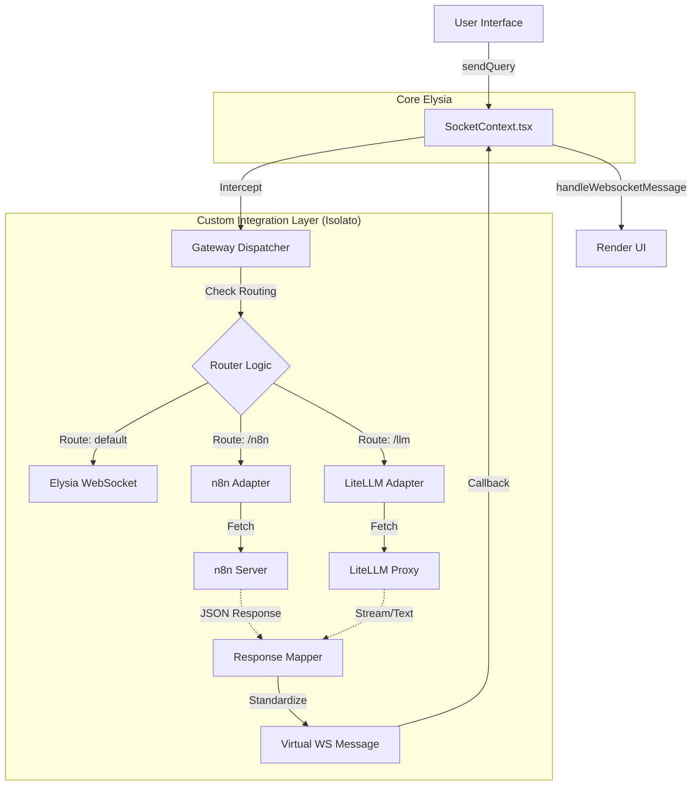

# Architettura Frontend Multi-Backend & Strategia di Isolamento

## 1. Executive Summary

L'obiettivo è trasformare il frontend di Elysia in un'interfaccia "Backend-Agnostic" capace di dialogare simultaneamente con:
1.  **Elysia Backend** (WebSocket nativo)
2.  **n8n Workflows** (REST/Webhook)
3.  **LLM Diretti** (via LiteLLM/DSPy o chiamate dirette)

Il vincolo critico è **l'isolamento delle modifiche**: garantire che l'applicazione possa ricevere aggiornamenti futuri dal repository ufficiale di Elysia senza che le personalizzazioni vengano sovrascritte o generino conflitti di merge ingestibili.

## 2. Analisi di Fattibilità Tecnica

L'attuale architettura di Elysia Frontend è basata sui seguenti pilastri che rendono questa operazione **altamente fattibile senza riscrivere la UI**:

*   **Disaccoppiamento UI/Dati**: `RenderChat.tsx` non si preoccupa della provenienza dei dati, ma solo di visualizzare oggetti di tipo `Message`.
*   **Gestione Centralizzata Messaggi**: `ConversationContext` espone `handleWebsocketMessage`, un punto di ingresso unico che accetta qualsiasi payload JSON conforme allo schema Elysia e lo inietta nella chat.
*   **Punto di Uscita Unico**: `SocketContext` centralizza l'invio delle richieste tramite `sendQuery`.

Sfruttando questi punti, possiamo iniettare dati da n8n o altri LLM fingendo che siano messaggi WebSocket di Elysia.

## 3. La Soluzione Architetturale: "The Gateway Pattern"

Per massimizzare l'isolamento, adotteremo il **Gateway Pattern**. L'idea è creare una "scatola" (directory) esterna al core di Elysia che contiene tutta la logica custom.

### 3.1 Struttura delle Directory

Tutto il nuovo codice risiederà in una directory dedicata, separata da `app/components` o `app/api`.

```plaintext
/app
  /integrations          <-- NOSTRA "SCATOLA" ISOLATA
    /gateway.ts          <-- Dispatcher centrale
    /types.ts            <-- Tipi unificati per le integrazioni
    /adapters
      /n8nAdapter.ts     <-- Logica specifica per n8n
      /llmAdapter.ts     <-- Logica per LiteLLM/Dspy
      /restAdapter.ts    <-- Logica generica HTTP
  /components            <-- CORE ELYSIA (Da non toccare se possibile)
  /api                   <-- CORE ELYSIA (Da non toccare se possibile)
```

### 3.2 Flusso Logico (Il Dispatcher Verticlae)



## 4. Strategia di Isolamento ("Surface Area Minimization")

Per rendere il codice "pluggabile" su future release, dobbiamo minimizzare la "Superfice di Contatto" (Surface Area of Contact) tra il nostro codice e quello di Elysia.

### Regola d'Oro: "Touchpoints Minimi"

Modificheremo **un solo file core**: `app/components/contexts/SocketContext.tsx`.

Invece di riscrivere la logica dentro `SocketContext`, inseriremo solo un "Hook di Intercettazione".

#### Il "Before" (Codice Originale)
```typescript
// SocketContext.tsx originale
const sendQuery = async (...) => {
    socket?.send(JSON.stringify({ ... }));
    return Promise.resolve(true);
};
```

#### Il "After" (Codice Modificato con Isolamento)
```typescript
// SocketContext.tsx modificato
import { Gateway } from "@/app/integrations/gateway"; // <--- UNICO IMPORT

const sendQuery = async (...) => {
    // --- CUSTOM GATEWAY START ---
    // Se il Gateway gestisce la richiesta, interrompiamo il flusso standard
    const handled = await Gateway.dispatch({
        user_id, query, conversation_id, route, 
        onMessage: handleWebsocketMessage // Passiamo la funzione per iniettare risposte
    });
    if (handled) return Promise.resolve(true);
    // --- CUSTOM GATEWAY END ---

    socket?.send(JSON.stringify({ ... }));
    return Promise.resolve(true);
};
```

### Vantaggi di questo approccio:
1.  **Merge Semplici**: Quando aggiorni Elysia, git segnalerà un conflitto su `SocketContext.tsx`. Dato che le tue modifiche sono racchiuse in blocchi commentati ben definiti (`// CUSTOM GATEWAY START`), risolvere il conflitto è banale (spesso automatico).
2.  **Portabilità**: Se Elysia cambia completamente struttura, devi solo trovare il nuovo punto dove i messaggi vengono inviati e reinserire le 3 righe di codice del Gateway.
3.  **Box Pluggabile**: Tutta la logica complessa (autenticazione n8n, parsing JSON, retry policies) vive dentro `/app/integrations`, cartella che non esiste nel repo originale di Elysia e quindi non verrà mai sovrascritta da un `git pull`.

## 5. Roadmap di Implementazione

### Fase 1: Setup dell'Infrastruttura
1.  Creare la directory `app/integrations`.
2.  Definire l'interfaccia `IntegrationAdapter` (input: query, output: standard message format).
3.  Implementare il `Gateway` singleton con logica di routing base (es. regex comandi `/n8n` o selettore UI).

### Fase 2: Implementazione Adapter n8n
1.  Creare `n8nAdapter.ts`.
2.  Implementare la logica `fetch` verso il Webhook n8n.
3.  Creare un `ResponseMapper` che converte l'output JSON di n8n nei tipi di Elysia (`ResultPayload` per dati strutturati, `ResponsePayload` per testo).

### Fase 3: Modifica Chirurgica
1.  Applicare la modifica a `SocketContext.tsx` per iniettare il Gateway.
2.  Testare il flusso end-to-end senza toccare il backend Python di Elysia.

## 6. Considerazioni Future

*   **Configurazione Dinamica**: In futuro, potremmo aggiungere un file `integrations.config.json` dentro la cartella `integrations` per definire gli endpoint n8n/LLM senza ricompilare il codice, caricandoli a runtime.
*   **UI Routing**: Se si vuole permettere all'utente di scegliere il "Modello/Agente" tramite UI (es. un dropdown "Usa n8n: Analisi Vendite"), potremmo dover toccare `app/components/chat/QueryInput.tsx`. Per mantenere l'isolamento, consiglierei di usare le "Slash Commands" nella chat (es. `/sales dammi i dati`) che il Gateway intercetta, evitando modifiche alla UI grafica.
