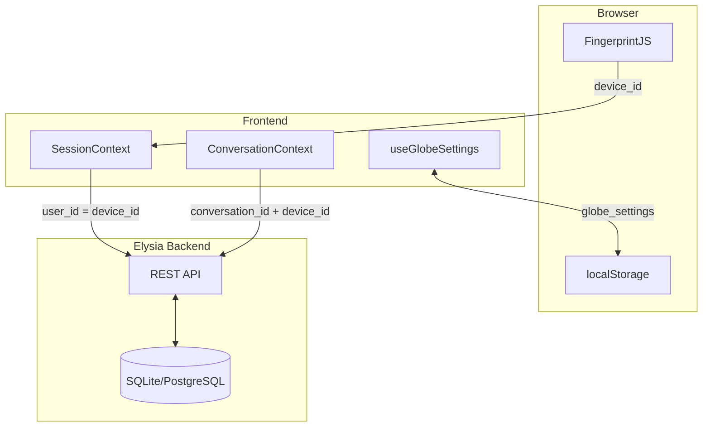
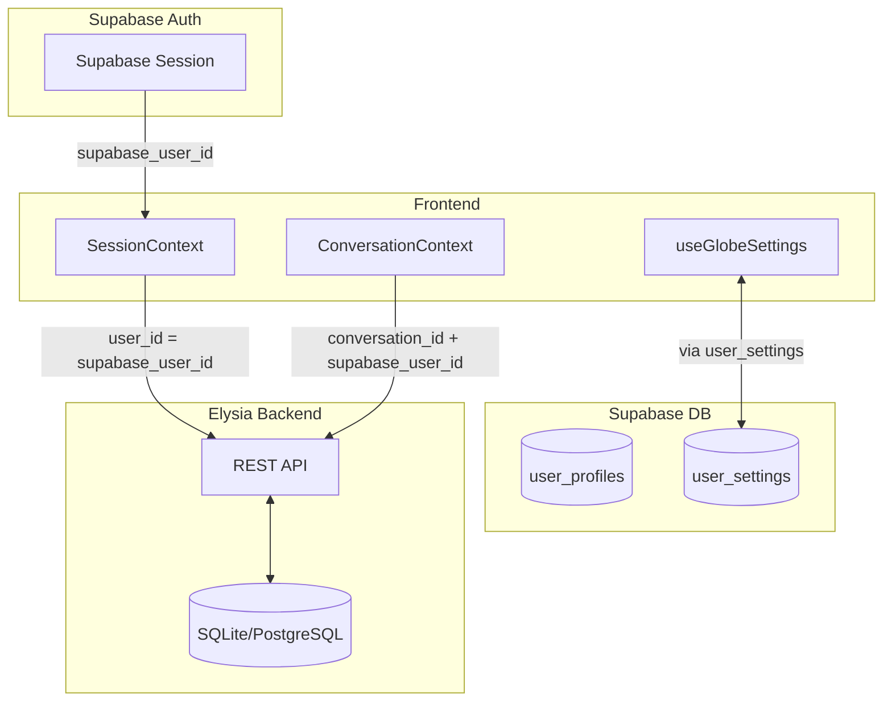

# Design: User-Scoped Data Migration

## Current Architecture

## Target Architecture

## Key Changes

### 1. Session Identity Source
**Before:** `useDeviceId()` → fingerprint from localStorage  
**After:** `useAuth()` → `user.id` from Supabase session

### 2. Globe Settings Storage
**Before:** `localStorage.getItem('globe_settings')`  
**After:** New `user_settings` table in Supabase with JSONB column

### 3. Backend API Calls
All API calls currently using `device_id` parameter will use `supabase_user_id`.

## Migration Strategy

### Phase 1: Identity Switch (This Change)
- Replace `useDeviceId()` with `supabase.auth.getUser().id`
- Update `SessionContext` to use authenticated user ID
- All existing data on Elysia backend will be orphaned for old device IDs

### Phase 2: Settings Migration (Future)
- Create `user_settings` table in Supabase for preferences
- Migrate globe settings from localStorage to Supabase
- Optional: Import legacy data if device_id can be associated with user

## Trade-offs

| Decision | Pros | Cons |
|----------|------|------|
| Break existing device-based data | Clean slate, simpler implementation | Users lose history from before auth |
| Use Supabase for settings | Centralized, cross-device sync | Additional DB calls |
| Keep globe settings in localStorage | Faster, no API latency | Not synced across devices |

**Chosen:** Break existing data for MVP. Globe settings move to Supabase for full cross-device experience.

## Security Considerations
- All API calls must validate `user_id` matches authenticated session
- Device fingerprint no longer used (removes privacy concern)
